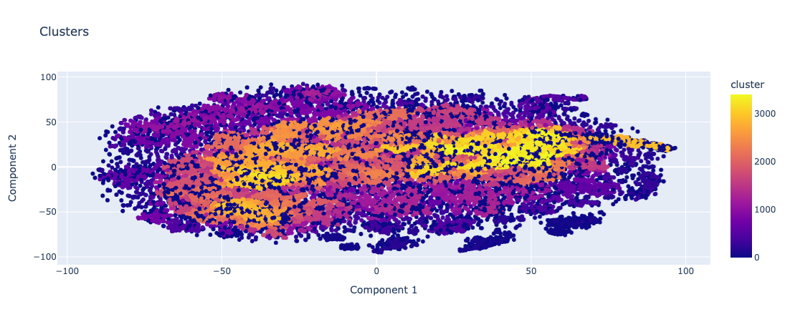

# Embed Clustering

### World War II Articles in Multiple Languages:

Capturing and analyzing the semantic differences in perspectives that are naturally embedded within different languages.

> Plot of **19430** slices from **227** variations of "[World War II](https://en.wikipedia.org/wiki/World_War_II)" wikipedia article
\
\

Download Interactive Graph: *removed*

> ### Model: [sentence-transformers/distiluse-base-multilingual-cased-v1](https://huggingface.co/sentence-transformers/distiluse-base-multilingual-cased-v1)
"Multilingual knowledge distilled version of multilingual Universal Sentence Encoder. Supports 15 languages: 
\
Arabic, Chinese, Dutch, English, French, German, Italian, Korean, Polish, Portuguese, Russian, Spanish, Turkish."
